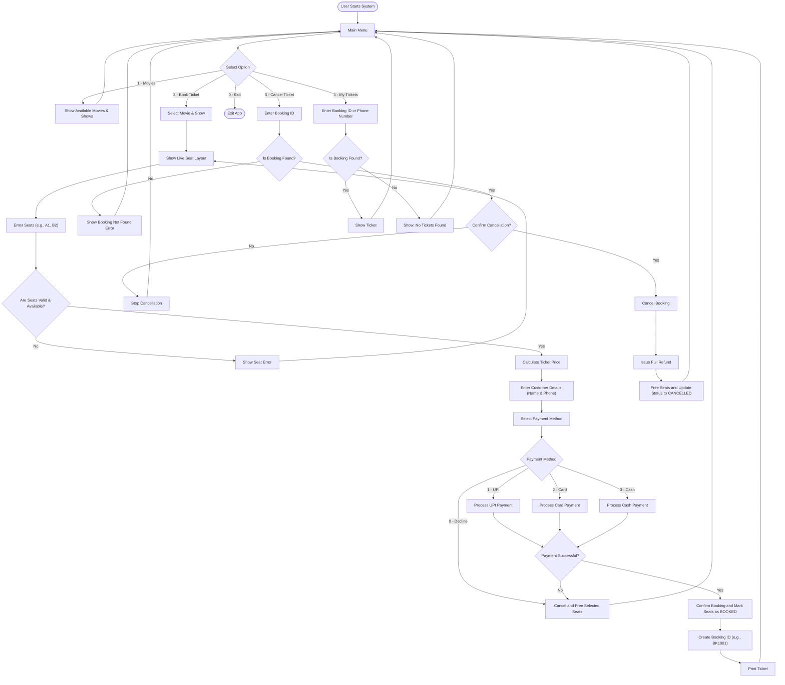

# Movie Ticket Booking System

Welcome to the Movie Ticket Booking System! This is a simple C++ program that lets you book movie tickets, just like you would at a real cinema.

---

## 1. What does this project do?

With this app, you can:
- **See Movies:** Look at which movies are playing.
- **Pick Seats:** See a live seating chart and pick your seats.
- **Pay:** Choose to pay with UPI, Card, or Cash.
- **Get a Ticket:** After paying, you get a printed ticket with your name and booking ID.
- **Cancel Tickets:** If you change your mind, you can cancel your booking and get a refund.
- **Search Tickets:** You can find your past tickets using your phone number or booking ID.

---

## 2. Project Files

The code is broken down into small, simple files so it's easy to read:
- `main1.cpp`: Starts the app and shows the main menu.
- `movie2.cpp`: Stores movie details (like title and language).
- `seat3.cpp` & `screen4.cpp`: Manages the cinema screens and seats.
- `cinema5.cpp`, `show7.cpp`, `showSeat6.cpp`: Connects movies to screens and tracks which seats are booked.
- `bookingService9.cpp`: The main logic that handles bookings and cancellations.
- `customer10.cpp`: Stores the customer's name and phone number.
- `payment11.cpp` to `cashPayment14.cpp`: Handles different payment methods.

---

## 3. How the System Works

This diagram shows how a user uses the system from start to finish.



---

## 4. Sequence Diagrams

### 4.1 UPI Payment Steps
This image shows what happens behind the scenes when a customer pays using UPI.


### 4.2 System Architecture
This image shows how the different parts of the code talk to each other.


---

## 5. How to Run the Code

To run this program, open your terminal in the `MovieTicketBookingSystem/` folder and type:

```bash
g++ main1.cpp
```

Then, start the program:

**On Windows:**
```powershell
.\a.exe
```

**On Mac or Linux:**
```bash
./a.out
```

---

## 6. Error Handling

The app is smart and won't crash if you make a mistake:
- **Wrong Seat:** If you type a seat that doesn't exist, it will tell you and let you try again.
- **Taken Seat:** If a seat is already booked, it won't let you book it again.
- **Payment Failed:** If you cancel your payment halfway, the seats are freed up for someone else.
- **Wrong Menu Option:** If you type letters instead of numbers, it will simply ask you again.
