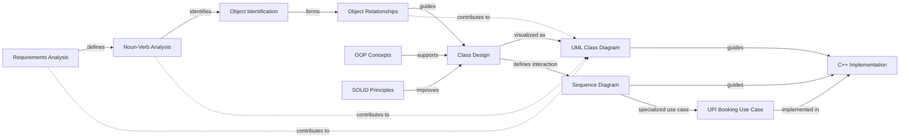

# 🎬 Cinema Booking System
> A C++ console-based Cinema Booking System designed to demonstrate
> **Low-Level Design (LLD), Object-Oriented Programming (OOP), SOLID principles, UML modeling, and software engineering practices.**

---

## 🎥 Video Demo

<div align="center">
  <video src="MovieTicketBookingSystem%20video/project%20demo.mp4" width="100%" controls="controls" style="border-radius: 8px; box-shadow: 0 4px 8px rgba(0,0,0,0.1);">
    <p>Your browser does not support the video tag.</p>
    <p>👉 <a href="MovieTicketBookingSystem%20video/project%20demo.mp4">Click here to view the Video Demo directly</a></p>
  </video>
</div>

---

## 📌 Project Overview
The **Cinema Booking System** is an in-memory console application developed in **C++** that simulates a basic real-world movie ticket booking workflow. The system covers the complete journey of a customer, starting from selecting a movie and show, checking seat availability, selecting a seat, calculating the ticket price, choosing a payment method, creating a booking, and finally printing the ticket.

The project focuses on understanding how a real-world problem can be converted into a structured software design using:
- Requirements Analysis
- Noun-Verb Analysis
- Object Identification
- Object Relationships
- Object-Oriented Programming
- SOLID Principles
- Class Design
- UML Class Diagrams
- Sequence Diagrams
- C++ Implementation

---

## 🎯 Objectives
The main objectives of this project are to:
- Convert real-world requirements into software objects.
- Identify classes and responsibilities using Noun-Verb Analysis.
- Define relationships between objects.
- Apply Object-Oriented Programming concepts.
- Apply SOLID design principles.
- Create a structured Low-Level Design.
- Represent the system using UML diagrams.
- Model object interaction using Sequence Diagrams.
- Implement the final design in C++.
- Understand the connection between analysis, design, and implementation.

---

## 🧭 Software Design Workflow
The project follows a structured software engineering process:
```text
Requirements Analysis
         ↓
Noun-Verb Analysis
         ↓
Object Identification
         ↓
Object Relationships
         ↓
Class Design
         ↓
UML Class Diagram
         ↓
Sequence Diagram
         ↓
C++ Implementation
```
**Supporting design principles:**
- OOP Concepts ──────────→ Class Design
- SOLID Principles ──────→ Class Design

This shows that the implementation is the final result of the analysis and design process.

## 🔗 Concept Relationship Graph
The following graph shows how all major software-engineering concepts used in this project are connected.



### 💡 What the Graph Means
The graph represents the complete design journey:
- Requirements define what the system needs to do.
- Noun-Verb Analysis identifies possible objects and operations.
- Object Relationships determine how those objects are connected.
- Class Design converts the identified objects into structured classes.
- OOP and SOLID provide principles for designing those classes properly.
- UML Class Diagram represents the static structure of the system.
- Sequence Diagram represents how objects communicate during execution.
- The UPI Booking Use Case is a specific example of the sequence flow.
- Finally, the design is converted into the C++ implementation.

---

## 📚 Documentation
The project documentation is divided into separate sections so that each software-engineering concept can be studied independently.

| # | Topic | Documentation |
|---|---|---|
| 1 | Requirements Analysis | [Open Documentation](Requirements-Analysis/requirements-analysis.md) |
| 2 | Noun-Verb Analysis | [Open Documentation](Noun-Verb-Analysis/noun-verb-analysis.md) |
| 3 | Object Relationships | [Open Documentation](Object-Relationships/object-relationships.md) |
| 4 | OOP Concepts | [Open Documentation](OOP-Concepts/oop-concepts.md) |
| 5 | SOLID Principles | [Open Documentation](SOLID-Principles/solid-principles.md) |
| 6 | Class Design | [Open Documentation](Class-Design/class-design.md) |
| 7 | UML Class Diagram | [Open Documentation](UML-Diagram/uml-class-diagram.md) |
| 8 | Sequence Diagram | [Open Documentation](Sequence-Diagram/sequence-diagram.md) |
| 9 | Relationship Graph | [Open Mermaid Source](Relationship-Graph/relationship-graph.mmd) |

---

## 📝 1. Requirements Analysis
Requirements Analysis defines what the Cinema Booking System is expected to do.

**The major functional requirements include:**
- Customer accesses the cinema system.
- Customer views available movies.
- Customer selects a movie.
- Customer selects a show.
- Customer selects a screen.
- Customer views available seats.
- Customer selects a seat.
- System checks seat availability.
- System calculates the ticket price.
- Customer selects a payment method.
- System processes the payment.
- System creates the booking.
- System generates the ticket.
- System prints the ticket.

**Payment Methods**
The system supports:
- UPI
- Card
- Cash

📖 **Detailed Documentation:** [Requirements Analysis](Requirements-Analysis/requirements-analysis.md)

---

## 🔤 2. Noun-Verb Analysis
Noun-Verb Analysis is used to extract possible objects and operations from the system requirements.

**Important Nouns**
`Cinema` `Screen` `Seat` `Movie` `Show` `ShowSeat` `Customer` `Booking` `Payment` `UpiPayment` `CardPayment` `CashPayment` `Ticket` `BookingService` `PriceCalculator` `TicketPrinter`

**Important Verbs**
`view` `select` `book` `check` `calculate` `pay` `process` `create` `generate` `print`

**For example:**
*Customer books a seat.*
Can be analyzed as:
- **Customer** → Candidate Object/Class
- **books** → Candidate Operation
- **seat** → Candidate Object/Class

Noun-Verb Analysis provides candidates; the final classes are decided after considering responsibilities and relationships.

📖 **Detailed Documentation:** [Noun-Verb Analysis](Noun-Verb-Analysis/noun-verb-analysis.md)

---

## 🔗 3. Object Relationships
The system contains several important relationships.

```text
Cinema ◆── Screen
Screen ◆── Seat
Show ◇── Movie
Show ◇── Screen
Show ◆── ShowSeat
ShowSeat ── Seat
Booking ── Customer
Booking ── Show
Booking ── Seat
Booking ── Payment

Payment
  ▲
  ├── UpiPayment
  ├── CardPayment
  └── CashPayment
```

**Where:**
- `◆` = Composition
- `◇` = Aggregation
- `──` = Association
- `▲` = Inheritance

These relationships describe how different objects collaborate within the system.

📖 **Detailed Documentation:** [Object Relationships](Object-Relationships/object-relationships.md)

---

## 🧱 4. OOP Concepts
The project demonstrates the four major Object-Oriented Programming concepts:

- **Encapsulation:** Data and the operations that work on that data are grouped inside classes.
- **Abstraction:** Common behavior can be represented through a higher-level abstraction such as Payment.
- **Inheritance:** Specific payment types can inherit from or implement the common payment abstraction.
- **Polymorphism:** Different payment implementations can be handled through the common Payment abstraction.

📖 **Detailed Documentation:** [OOP Concepts](OOP-Concepts/oop-concepts.md)

---

## 🧩 5. SOLID Principles
SOLID principles are used as design guidelines for creating maintainable classes.

| Principle | Meaning |
|---|---|
| S | Single Responsibility Principle |
| O | Open/Closed Principle |
| L | Liskov Substitution Principle |
| I | Interface Segregation Principle |
| D | Dependency Inversion Principle |

**Examples of separated responsibilities:**
- `BookingService` ↓ Handles booking workflow
- `PriceCalculator` ↓ Calculates ticket price
- `TicketPrinter` ↓ Prints ticket
- `Payment` ↓ Represents payment abstraction

📖 **Detailed Documentation:** [SOLID Principles](SOLID-Principles/solid-principles.md)

---

## 🏗️ 6. Class Design
The major classes identified for the system are:

```text
Cinema
Screen
Seat
Movie
Show
ShowSeat
Customer
Booking
BookingService
PriceCalculator
TicketPrinter
Payment
  ├── UpiPayment
  ├── CardPayment
  └── CashPayment
```

Each class has a specific responsibility. For example:

| Class | Responsibility |
|---|---|
| Cinema | Represents cinema information |
| Movie | Represents a movie |
| Show | Represents a movie show |
| Screen | Represents a cinema screen |
| Seat | Represents a physical seat |
| ShowSeat | Represents seat availability for a show |
| Customer | Represents the customer |
| Booking | Represents a completed booking |
| BookingService | Coordinates booking operations |
| PriceCalculator | Calculates ticket price |
| Payment | Represents payment abstraction |
| TicketPrinter | Prints the booking ticket |

📖 **Detailed Documentation:** [Class Design](Class-Design/class-design.md)

---

## 📐 7. UML Class Diagram
The UML Class Diagram represents the static structure of the Cinema Booking System.

It shows: Classes, Attributes, Methods, Visibility, Relationships, Multiplicity, Composition, Aggregation, Association, Inheritance, Abstract payment structure.

**UML Source:** `UML-Diagram/uml-class-diagram.mmd`

📖 **Detailed Documentation:** [UML Class Diagram](UML-Diagram/uml-class-diagram.md)

---

## 🔄 8. Sequence Diagram
The Sequence Diagram represents the dynamic behavior of the system. It shows how objects communicate during a particular operation.

The selected use case is: **Customer books 1 seat and pays using UPI.**

**Main lifelines:**
`Customer` `BookingService` `Show` `ShowSeat` `PriceCalculator` `UpiPayment` `Booking` `TicketPrinter`

**Sequence Flow:**
`Customer` ↓ `BookingService` ↓ `Show` ↓ `ShowSeat` ↓ `PriceCalculator` ↓ `UpiPayment` ↓ `Booking` ↓ `TicketPrinter`

📖 **Detailed Documentation:** [Sequence Diagram](Sequence-Diagram/sequence-diagram.md)

---

## 💳 Customer Books 1 Seat and Pays by UPI
This is the concrete use case represented in the sequence diagram.

**Workflow:**
1. Customer selects a movie/show
2. Customer selects one seat
3. BookingService receives booking request
4. System checks seat availability
5. PriceCalculator calculates ticket price
6. UpiPayment processes payment
7. Payment succeeds
8. Booking is created
9. Ticket is printed
10. Customer receives confirmation

🖼️ **Project Diagrams:**
- [UML Class Diagram](images/UML-diagram.png)
- [Sequence Diagram](images/squence%20diagram.png)
- [UPI Booking Sequence](images/Cinema_Booking_UPI_Sequence_Diagram.png)

---

## 📂 Project Structure
```text
Cinema-Booking-System/
│
├── README.md
├── Requirements-Analysis/
│   └── requirements-analysis.md
├── Noun-Verb-Analysis/
│   └── noun-verb-analysis.md
├── Object-Relationships/
│   └── object-relationships.md
├── OOP-Concepts/
│   └── oop-concepts.md
├── SOLID-Principles/
│   └── solid-principles.md
├── Class-Design/
│   └── class-design.md
├── UML-Diagram/
│   ├── uml-class-diagram.md
│   └── uml-class-diagram.mmd
├── Sequence-Diagram/
│   ├── sequence-diagram.md
│   └── sequence-diagram.mmd
├── Relationship-Graph/
│   └── relationship-graph.mmd
├── images/
│   ├── UML-diagram.png
│   ├── squence diagram.png
│   └── Cinema_Booking_UPI_Sequence_Diagram.png
│
└── MovieTicketBookingSystem video/
    └── project demo.mp4
```

---

## ▶️ How to Run
The project is implemented as a C++ console application.

**Compile**
```bash
g++ main1.cpp -o MovieTicketBooking
```

**Run**
Linux / macOS:
```bash
./MovieTicketBooking
```
Windows:
```bash
MovieTicketBooking.exe
```

Make sure a C++ compiler such as G++ / MinGW is installed and available in your system PATH.

---

## 🔍 Complete Design Flow
The complete relationship between analysis, design, and implementation is:
```text
REQUIREMENTS
      │
      ▼
NOUN-VERB ANALYSIS
      │
      ▼
OBJECT IDENTIFICATION
      │
      ▼
OBJECT RELATIONSHIPS
      │
      ▼
CLASS DESIGN ◄── OOP CONCEPTS
      ▲      ◄── SOLID PRINCIPLES
      │
      ▼
UML CLASS DIAGRAM
      │
      ▼
SEQUENCE DIAGRAM
      │
      ▼
IMPLEMENTATION
```
This demonstrates that implementation is not developed independently. It is the result of a structured analysis and design process.

---

## 🎓 Learning Outcomes
This project provides practical understanding of:
- Requirements Analysis
- Noun-Verb Analysis
- Object Identification
- Object Relationships
- Object-Oriented Programming (Encapsulation, Abstraction, Inheritance, Polymorphism)
- SOLID Principles
- Low-Level Design
- Class Responsibility
- UML Class Modeling
- Sequence Modeling
- Object Interaction
- C++ Implementation
- Software Documentation

---

## 🚀 Key Takeaway
The main goal of this project is to demonstrate the complete journey from a real-world requirement to a structured software implementation.

`Real-World Problem` ↓ `Requirements` ↓ `Analysis` ↓ `Objects` ↓ `Relationships` ↓ `Class Design` ↓ `OOP + SOLID` ↓ `UML` ↓ `Object Interaction` ↓ `C++ Implementation`

The project therefore demonstrates not only how to write code, but also how to think, analyze, design, model, and then implement a software system.

---

## 📌 Conclusion
The Cinema Booking System is a practical demonstration of software engineering and Low-Level Design using C++. It connects requirements analysis, object modeling, OOP, SOLID principles, class design, UML diagrams, sequence modeling, and implementation into one complete workflow. The project shows how a real-world cinema booking problem can be gradually transformed into a structured, understandable, and maintainable software design.
