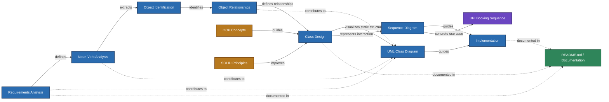

# Cinema Booking System

## 🎥 Video Demo
<video src="MovieTicketBookingSystem video/project demo.mp4" controls="controls" style="max-width: 100%;">
  Your browser does not support the video tag. Please view the video file directly in the `MovieTicketBookingSystem video` folder.
</video>

---

## Project Overview
The Cinema Booking System is an in-memory Console Application built in C++ that simulates a real-world movie theater experience. It handles everything from browsing movies and selecting seats to processing payments and generating a final booking ticket. This project serves as a comprehensive demonstration of Low-Level Design (LLD), Object-Oriented Programming (OOP), and clean software architecture.

## Objectives
The main objective of this project is to apply standard software engineering practices to translate functional requirements into a working software system. It bridges the gap between theoretical concepts (Requirement Analysis, UML Design, SOLID Principles) and practical implementation in C++.

## Documentation Index
The documentation for this project has been carefully modularized into folders. Please explore the sections below to understand the complete software engineering lifecycle:

1. **[Requirements Analysis](Requirements-Analysis/requirements-analysis.md)**
2. **[Noun-Verb Analysis](Noun-Verb-Analysis/noun-verb-analysis.md)**
3. **[Object Relationships](Object-Relationships/object-relationships.md)**
4. **[Class Design](Class-Design/class-design.md)**
   - *Supporting Principles:*
     - [OOP Concepts](OOP-Concepts/oop-concepts.md)
     - [SOLID Principles](SOLID-Principles/solid-principles.md)
5. **[UML Class Diagram](UML-Diagram/uml-class-diagram.md)**
6. **[Sequence Diagram & UPI Use Case](Sequence-Diagram/sequence-diagram.md)**

---

## Concept Relationship Graph
The following flowchart visually communicates the complete software design workflow, demonstrating how each engineering concept connects and contributes to the final product.

*(View the raw Mermaid code in [relationship-graph.mmd](Relationship-Graph/relationship-graph.mmd))*



## Project Structure
The C++ codebase is modularized according to the Single Responsibility Principle, ensuring clean separations between core logic (`BookingService`), entities (`Show`, `Seat`), and payment interfaces. To run the code, use the following commands:

```bash
g++ main1.cpp -o MovieTicketBooking
./MovieTicketBooking
```

## Complete Design Flow
This project proves that writing code is merely the final step of software engineering. The bulk of the work lies in mapping requirements, analyzing nouns and verbs, determining object relationships, strictly adhering to OOP/SOLID paradigms, and verifying logic via UML and Sequence charts prior to implementation.

## Learning Outcomes
By following this architecture, one can learn how enterprise systems decouple logic, handle polymorphic workflows, and translate raw text requirements into strict, compilable class structures.

## Conclusion
The Cinema Booking System effectively simulates real-world transaction workflows through a rigorous application of software engineering principles. It stands as a prime example of translating a logical UML design into a fully functional implementation.
