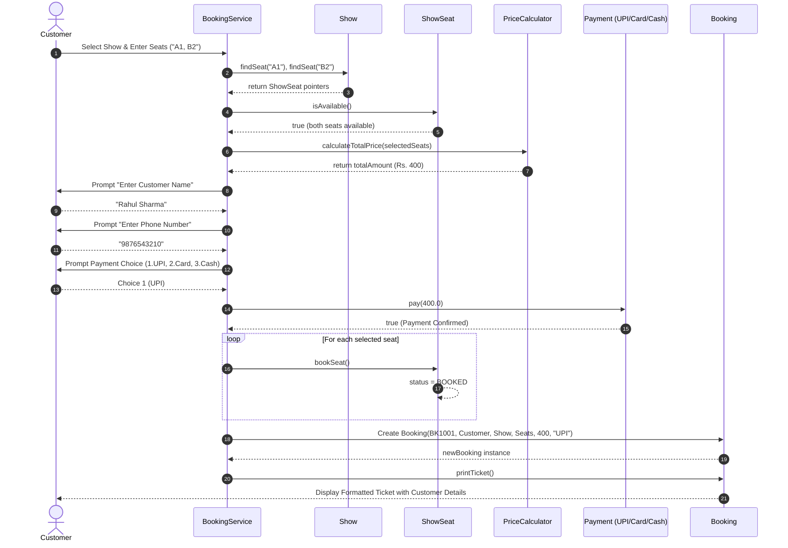

# Movie Ticket Booking System

  

> **Course:** B.Tech. CSE (Semester 5)  

> **Subject:** System Design (TCS-504)  

> **Technology Stack:** C++ (C++11 / C++14 / C++17 / C++20 Compatible)  

> **Architecture Pattern:** Object-Oriented Low-Level Design (LLD), SOLID Principles, Modular Architecture

  

---

  

## Table of Contents

  

- [1. Project Overview](#1-project-overview)

- [2. Project Directory Structure](#2-project-directory-structure)

- [3. Modular System Architecture (All 14 Files)](#3-modular-system-architecture-all-14-files)

- [4. Scope & The 8 Core Functional Features](#4-scope--the-8-core-functional-features)

- [5. Customer Management & Checkout Flow](#5-customer-management--checkout-flow)

- [6. Object-Oriented Design & UML Class Diagram](#6-object-oriented-design--uml-class-diagram)

  - [6.1 Complete UML Class Diagram](#61-complete-uml-class-diagram)

  - [6.2 Class Hierarchy & Architecture Diagram](#62-class-hierarchy--architecture-diagram)

  - [6.3 The 4 Pillars of OOP in System Design](#63-the-4-pillars-of-oop-in-system-design)

  - [6.4 SOLID Principles Compliance](#64-solid-principles-compliance)

- [7. Object Relationships & Lifetime Justifications](#7-object-relationships--lifetime-justifications)

  - [7.1 Visual Object Relationship Diagrams](#71-visual-object-relationship-diagrams)

- [8. End-to-End System Workflow](#8-end-to-end-system-workflow)

- [9. Sequence Diagrams (Booking & Payment Flow)](#9-sequence-diagrams-booking--payment-flow)

  - [9.1 UML Sequence Diagram: Book Seats & Pay by UPI](#91-uml-sequence-diagram-book-seats--pay-by-upi)

  - [9.2 Architectural Interaction Sequence Diagram](#92-architectural-interaction-sequence-diagram)

  - [9.3 Full Sequence Lifecycle & Ticket Generation Layout](#93-full-sequence-lifecycle--ticket-generation-layout)

  - [9.4 Interactive Mermaid Sequence Diagram](#94-interactive-mermaid-sequence-diagram)

- [10. Compilation and Execution Guide (VS Code & Terminal)](#10-compilation-and-execution-guide-vs-code--terminal)

  - [10.1 Quickest 1-Step Command (Compile & Run in VS Code)](#101-quickest-1-step-command-compile--run-in-vs-code)

  - [10.2 Step-by-Step Terminal Instructions](#102-step-by-step-terminal-instructions)

  - [10.3 Cross-Platform Terminal Commands](#103-cross-platform-terminal-commands)

- [11. Input Validation & Edge Case Handling Matrix](#11-input-validation--edge-case-handling-matrix)

- [12. Clean Code Rules & Deliberate Non-Actions](#12-clean-code-rules--deliberate-non-actions)

  

---

  

## 1. Project Overview

  

The **Movie Ticket Booking System** is an interactive, production-grade Low-Level Design (LLD) console application developed in modern C++ for a multiplex cinema chain (e.g., **PVR Cinemas**).

  

The system provides end-to-end cinema management operations:

- **Multiplex Cataloging:** Managing auditoriums (Screens), running Movies, and scheduled Screenings (Shows).

- **Dynamic Seating Matrix:** Real-time visual terminal layout depicting available seats (`[ ]`) and reserved seats (`[X]`) categorized across multiple seating classes (**SILVER**, **GOLD**, **PLATINUM**).

- **Tiered Pricing Engine:** Real-time computation of seat prices according to tier categories (Silver ₹150, Gold ₹250, Platinum ₹400).

- **Customer Identity Capture:** Capturing the customer's **Full Name** and **Mobile Phone Number** during the checkout flow.

- **Polymorphic Payment Processing:** Pluggable payment strategies (**UPI**, **Credit/Debit Card**, **Cash Counter**) with payment decline simulation.

- **Transactional Rollback:** Guarantees that any declined or aborted payment immediately frees temporarily held seats back to available status (`[ ]`).

- **Formatted Cinema Ticket:** Generating tickets complete with unique Booking IDs (e.g., `BK1001`), Customer Name, Phone Number, Showtime, Seat codes, Total Amount, and Payment Method.

- **Dual Ticket Lookup:** Looking up confirmed and cancelled tickets via either **Booking ID** or **Customer Mobile Number**.

- **Booking Cancellation & Refund:** Instant ticket cancellation, full refund issuance, and automatic seat release back to the cinema pool.

  

---

  

## 2. Project Directory Structure

  

The project follows **modular programming principles**, with each class and responsibility organized into its own dedicated source file.

| Directory / File                        | Description                                                                      |
| :-------------------------------------- | :------------------------------------------------------------------------------- |
| `main1.cpp`                             | Entry point: initializes the cinema, seeds demo data, and launches the main menu |
| `movie2.cpp`                            | Movie entity: ID, title, language, and duration                                  |
| `seat3.cpp`                             | Physical Seat entity: seat number and seat type                                  |
| `screen4.cpp`                           | Screen entity: screen ID, name, and seat composition                             |
| `cinema5.cpp`                           | Cinema entity: cinema name, screens, and movie catalog                           |
| `showSeat6.cpp`                         | Show-seat status tracker: `AVAILABLE` / `BOOKED`                                 |
| `show7.cpp`                             | Show entity: movie, screen, show time, and seat layout                           |
| `priceCalculator8.cpp`                  | Price calculation engine: tier-based pricing and totals                          |
| `bookingService9.cpp`                   | Booking orchestrator: reservations, tickets, cancellations, and rollback         |
| `customer10.cpp`                        | Customer entity: name, phone number, and validation                              |
| `payment11.cpp`                         | Abstract `Payment` base class for polymorphic payments                           |
| `upiPayment12.cpp`                      | `UpiPayment` implementation: UPI validation and payment processing               |
| `cardPayment13.cpp`                     | `CardPayment` implementation: card processing and masking                        |
| `cashPayment14.cpp`                     | `CashPayment` implementation: cash payment and receipt generation                |
| `MovieTicketBookingSystem assignment/`  | Academic assignment prompt and specification documents                           |
| `MovieTicketBookingSystem pdf/`         | System Design documentation and analysis PDFs                                    |
| `MovieTicketBookingSystem image/`       | UML and system-design diagram images                                             |
| `MovieTicketBookingSystem screenshots/` | Application execution screenshots                                                |
| `README.md`                             | Main project documentation and usage information                                 |
  

---

  

## 3. Modular System Architecture (All 14 Files)

  

In accordance with TCS-504 System Design guidelines, each class follows the principles of **high cohesion, low coupling, and single responsibility**.

|  No.   | Source File            | Class Name                   | What It Knows (Data)                                   | What It Does (Methods)                                                           | What It Must NOT Do                           |
| :----: | :--------------------- | :--------------------------- | :----------------------------------------------------- | :------------------------------------------------------------------------------- | :-------------------------------------------- |
| **1**  | `main1.cpp`            | `CinemaMainMenu` / `main()`  | Initial system configuration and seed data             | Initializes objects and starts the application/menu                              | Does not calculate prices or process payments |
| **2**  | `movie2.cpp`           | `Movie`                      | `movieId`, `title`, `language`, `durationInMinutes`    | Provides movie metadata                                                          | Does not manage shows or ticket prices        |
| **3**  | `seat3.cpp`            | `Seat`                       | `seatNumber`, `seatType`                               | Provides physical seat attributes                                                | Does not track booking status                 |
| **4**  | `screen4.cpp`          | `Screen`                     | `screenId`, `screenName`, `seats`                      | Stores screen information and manages seats                                      | Does not manage movies or show timings        |
| **5**  | `cinema5.cpp`          | `Cinema`                     | `cinemaName`, `screens`, `movies`                      | Manages cinema screens and movie catalog                                         | Does not handle bookings or payments          |
| **6**  | `showSeat6.cpp`        | `ShowSeat`                   | `Seat` reference, `status`                             | `bookSeat()`, `releaseSeat()`, `isAvailable()`                                   | Does not calculate prices or process payments |
| **7**  | `show7.cpp`            | `Show`                       | `showId`, `Movie*`, `Screen*`, `showTime`, `showSeats` | Searches seats and displays the seat layout                                      | Does not process payments or manage bookings  |
| **8**  | `priceCalculator8.cpp` | `PriceCalculator`            | Silver, Gold, Platinum prices                          | `calculateSeatPrice()`, `calculateTotalPrice()`                                  | Does not modify seat availability             |
| **9**  | `bookingService9.cpp`  | `BookingService` / `Booking` | Shows, bookings, booking sequence                      | Coordinates booking, customer input, rollback, cancellation, and ticket printing | Does not implement payment-specific logic     |
| **10** | `customer10.cpp`       | `Customer`                   | `customerName`, `phoneNumber`                          | Stores and validates customer details                                            | Does not process payments or reserve seats    |
| **11** | `payment11.cpp`        | `Payment` _(Abstract)_       | Payment interface contract                             | Declares `pay()` and `getPaymentType()`                                          | Cannot be instantiated directly               |
| **12** | `upiPayment12.cpp`     | `UpiPayment`                 | `upiId`                                                | Validates UPI ID and processes UPI payment                                       | Does not modify seat or booking records       |
| **13** | `cardPayment13.cpp`    | `CardPayment`                | `cardNumber`, `expiryDate`                             | Processes card payment and masks card details                                    | Does not manage bookings or cancellations     |
|   14   | `cashPayment14.cpp`    | `CashPayment`                | Cash receipt identifier                                | Processes cash payment and generates receipt                                     | Does not manage seat availability directly    |
  

---

  

## 4. Scope & The 8 Core Functional Features

  

The project fulfills all 8 mandatory Functional Requirements (**F1** to **F8**) specified in the TCS-504 System Design syllabus:

  

- **F1: List Running Movies:** Displays all active movies with their title, audio language, and runtime in minutes.

- **F2: List Shows for Chosen Movie:** Displays scheduled screens (e.g. `Screen-1`, `Screen-2`) and showtimes (e.g. `06:00 PM`, `09:00 PM`) for any selected movie.

- **F3: Display Live Seat Matrix:** Renders an ASCII seat layout grouped by category (**SILVER**, **GOLD**, **PLATINUM**) with live availability status indicators (`[ ]` for AVAILABLE, `[X]` for BOOKED).

- **F4: Multi-Seat Booking with Conflict Detection:** Supports comma-separated seat selection (e.g., `A1,B2`), converts input to uppercase automatically (`a1, b2` $\rightarrow$ `A1, B2`), checks seat existence, prevents duplicate input, and rejects already booked seats.

- **F5: Tier-Based Pricing Engine:** Transparently calculates and itemizes costs based on seat category:

  - **SILVER Tier:** ₹150 per seat

  - **GOLD Tier:** ₹250 per seat

  - **PLATINUM Tier:** ₹400 per seat

- **F6: Polymorphic Payment Processing & Seat Rollback:** Processes payments through polymorphic payment gateways (UPI, Card, Cash). If payment is declined or cancelled, seats are immediately rolled back to available (`[ ]`).

- **F7: Formatted Cinema Ticket Generation:** Produces a formatted ASCII ticket upon confirmation displaying Booking ID, Customer Name, Phone Number, Movie, Screen, Showtime, Seats, Total Amount, Status, and Payment Mode.

- **F8: Ticket Cancellation & Automatic Seat Release:** Allows customers to cancel bookings using their Booking ID, immediately initiating a full refund, marking the ticket as `CANCELLED`, and releasing seats back to `[ ]` for other patrons.

  

---

  

## 5. Customer Management & Checkout Flow

  

Customer information capture is built directly into the booking and ticket lookup lifecycle:

  

1. **Information Capture:** After seat selection and price calculation, the system prompts for:

   - **Customer Full Name** (e.g., `Rahul Sharma`)

   - **Customer Mobile Phone Number** (e.g., `9876543210`)

2. **Encapsulation in Entity:** Contact details are bundled into the `Customer` class (`customer10.cpp`), which provides validation via `isValid()`.

3. **Ticket Association:** Every confirmed `Booking` stores an independent copy of the `Customer` object.

4. **Ticket Presentation:** The customer's Name and Phone Number are prominently printed on the issued cinema ticket.

5. **Dual-Criteria Lookup:** Under Option 4 (`My tickets`), users can look up their bookings using either:

   - Their unique **Booking ID** (e.g., `BK1001`), OR

   - Their **Customer Phone Number** (e.g., `9876543210`). The system will return all tickets associated with that phone number!

6. **Cancellation Verification:** During ticket cancellation under Option 3, the customer's name and phone number are displayed for identity confirmation before the cancellation is finalized.

  

---

  

## 6. Object-Oriented Design & UML Class Diagram

  

### 6.1 Complete UML Class Diagram

  

The following comprehensive UML Class Diagram illustrates all 14 classes in the system, detailing their private member variables, public member functions, parameter signatures, and design relationships:

  


  

#### UML Notation Key
|     Symbol     |     Notation     | Relationship / Element                | System Design Implementation                                         |
| :------------: | :--------------: | :------------------------------------ | :------------------------------------------------------------------- |
|     `*--`      |      `◆──`       | **Composition (Strong Ownership)**    | `Cinema` owns `Screen`; `Screen` owns `Seat`; `Show` owns `ShowSeat` |
|     `o--`      |      `◇──`       | **Aggregation (Shared Reference)**    | `Show` aggregates `Movie`; `Show` aggregates `Screen`                |
|     `-->`      |      `──▶`       | **Association (Usage / Interaction)** | `Booking` associates with `Customer`                                 |
|       `<       |       --`        | `──▷`                                 | **Inheritance (Generalization)**                                     |
|     `"1"`      |   Multiplicity   | Exactly one instance                  | Each `Show` has exactly 1 `Movie` and 1 `Screen`                     |
|    `"1..*"`    |   Multiplicity   | One or more instances                 | Each `Screen` contains multiple `Seat` objects                       |
|      `-`       | Access Specifier | Private member variable               | `- std::string customerName;``- std::string phoneNumber;`            |
|      `+`       | Access Specifier | Public member method                  | `+ bool pay(double amount);``+ void printTicket();`                  |
| `<<abstract>>` |    Stereotype    | Abstract base class / Interface       | `Payment` uses pure virtual methods `pay()` and `getPaymentType()`   |

  

---

  

### 6.2 Class Hierarchy & Architecture Diagram

  

The architectural diagram below highlights the segregation between core domain models, state trackers, behavior engines, and the polymorphic payment strategy tree:

  


  

---

  

### 6.3 The 4 Pillars of OOP in System Design

  

1. **Encapsulation:**

   - Data members in `Customer`, `Movie`, `Seat`, `Screen`, `Show`, `ShowSeat`, and `Booking` are strictly `private`.

   - Access and state mutations are governed via controlled public getter methods and explicit mutation operations (`bookSeat()`, `releaseSeat()`, `cancel()`).

2. **Abstraction:**

   - `Payment` defines an abstract interface with pure virtual methods `pay(double amount)` and `getPaymentType()`.

   - `BookingService` interacts with payment gateways exclusively through the high-level `Payment&` reference without coupling itself to low-level transaction details.

3. **Inheritance:**

   - `UpiPayment`, `CardPayment`, and `CashPayment` inherit from the common base class `Payment`.

4. **Polymorphism:**

   - Runtime dynamic dispatch is achieved via `processPayment(Payment& paymentMethod, double amount)`. The specific payment strategy executes polymorphically without bulky `switch-case` branches in the service layer.

  

---

  

### 6.4 SOLID Principles Compliance

  

- **Single Responsibility Principle (SRP):**

  - `PriceCalculator` calculates amounts; it never alters seat states.

  - `ShowSeat` maintains availability for a single show screening; it has no knowledge of payment cards or customer identities.

  - `Customer` manages personal contact information only.

- **Open/Closed Principle (OCP):**

  - The payment module is open for extension but closed for modification. Introducing `NetBankingPayment` or `CryptoPayment` only requires creating a new subclass of `Payment`. `BookingService` remains untouched.

- **Liskov Substitution Principle (LSP):**

  - Any concrete subclass (`UpiPayment`, `CardPayment`, `CashPayment`) can seamlessly substitute `Payment&` inside `processPayment()` without breaking application invariants.

- **Interface Segregation Principle (ISP):**

  - Interfaces are kept minimal and focused. `Payment` declares only the methods strictly necessary for completing transactions.

- **Dependency Inversion Principle (DIP):**

  - `BookingService` depends on the abstraction `Payment`, rather than directly binding to concrete classes like `CardPayment` or `UpiPayment`.

  

---

  

## 7. Object Relationships & Lifetime Justifications

  

| Relationship Pair            | Type        | UML Notation | Justification                                                                    |
| ---------------------------- | ----------- | ------------ | -------------------------------------------------------------------------------- |
| **Cinema ── Screen**         | Composition | `◆──`        | Screens belong to a Cinema and are destroyed with it.                            |
| **Screen ── Seat**           | Composition | `◆──`        | Seats belong to a Screen and are destroyed with it.                              |
| **Show ── Movie**            | Association | `───`        | Cancelling a Show does not destroy the Movie.                                    |
| **Show ── Screen**           | Association | `───`        | Cancelling a Show does not destroy the Screen.                                   |
| **Show ── ShowSeat**         | Composition | `◆──`        | ShowSeat records exist only for a particular Show.                               |
| **Booking ── Customer**      | Association | `───`        | Deleting a Booking does not delete the Customer.                                 |
| **Booking ── ShowSeat**      | Association | `───`        | Booking references ShowSeat; cancellation releases the seat without deleting it. |
| **Payment ── UPI/Card/Cash** | Inheritance | `Payment <   | UPI, Card, and Cash are specialized implementations of Payment.                  |

  

---

  

### 7.1 Visual Object Relationship Diagrams

  

The relationships, multiplicities, and lifecycle dependencies are visually illustrated in the design charts below:

  

#### Object Relationships — Core Entities (Part 1)

  


  

#### Object Relationships — Bookings, Customers & Payments (Part 2)

  


  

---

  

## 8. End-to-End System Workflow

  


  

---

  

## 9. Sequence Diagrams (Booking & Payment Flow)

  flowchart TD
    Start([User Starts System]) --> Menu[Main Menu]

    Menu --> M1{Select Option}

    M1 -->|1 - Movies| ShowMovies[Display Available Movies & Scheduled Shows]
    ShowMovies --> Menu

    M1 -->|2 - Book Ticket| SelectMovie[Select Movie & Scheduled Show]
    SelectMovie --> Layout[Display Live Visual Seat Layout]

    Layout --> PickSeats[Enter Seats<br/>Example: A1, B2]
    PickSeats --> Validate{Seats Valid,<br/>Available & Unique?}

    Validate -->|No| ShowError[Display Seat Validation Error]
    ShowError --> Layout

    Validate -->|Yes| CalcPrice[Calculate Ticket Price<br/>Silver ₹150 / Gold ₹250 / Platinum ₹400]

    CalcPrice --> CustInfo[Enter Customer Details<br/>Full Name & Mobile Number]
    CustInfo --> SelectPay[Select Payment Mode]

    SelectPay --> PayMode{Payment Mode}

    PayMode -->|1 - UPI| UPIPay[Process UPI Payment]
    PayMode -->|2 - Card| CardPay[Process Card Payment]
    PayMode -->|3 - Cash| CashPay[Process Cash Payment]
    PayMode -->|0 - Decline| Rollback[Rollback Transaction<br/>Release Selected Seats]

    UPIPay --> PayCheck{Payment Successful?}
    CardPay --> PayCheck
    CashPay --> PayCheck

    PayCheck -->|No| Rollback
    PayCheck -->|Yes| Confirm[Confirm Booking<br/>Mark Selected Seats as BOOKED]

    Confirm --> GenTicket[Generate Booking Record<br/>Example: BK1001]
    GenTicket --> PrintTicket[Print Formatted Ticket]
    PrintTicket --> Menu

    Rollback --> Menu

    M1 -->|3 - Cancel Ticket| CancelPrompt[Enter Booking ID]
    CancelPrompt --> FindBooking{Active Booking Found?}

    FindBooking -->|No| CancelErr[Display Booking Not Found<br/>or Already Cancelled]
    CancelErr --> Menu

    FindBooking -->|Yes| ConfirmCancel{Confirm Cancellation?}

    ConfirmCancel -->|No| Abort[Cancellation Aborted]
    Abort --> Menu

    ConfirmCancel -->|Yes| CancelBooking[Process Cancellation]
    CancelBooking --> Refund[Issue Full Refund]
    Refund --> Release[Release Seats<br/>Update Status to CANCELLED]
    Release --> Menu

    M1 -->|4 - My Tickets| Lookup[Enter Booking ID or Phone Number]
    Lookup --> Search{Booking Found?}

    Search -->|Yes| ShowTicket[Display Confirmed / Cancelled Ticket]
    ShowTicket --> Menu

    Search -->|No| NotFound[Display: No Tickets Found]
    NotFound --> Menu

    M1 -->|0 - Exit| ExitApp([Cleanly Exit Application])


### 9.1 UML Sequence Diagram: Book Seats & Pay by UPI

  

The diagram below represents the exact chronological interaction between actors, services, and entities for the primary assignment use case: **"Customer books seats and pays via UPI"**:

  


  

---

  

### 9.2 Architectural Interaction Sequence Diagram

  

The architectural sequence model below maps out the request/response lifelines, activation bars, and synchronous method call chains:

  


  

---

  

### 9.3 Interactive Mermaid Sequence Diagram

  

The interactive sequence diagram below maps out the runtime method dispatch:

  



  

---

  

## 10. Compilation and Execution Guide

  

### Prerequisites

- Any standard C++ compiler supporting C++11 or higher (`g++`, `clang++`, or MSVC).

- Works out-of-the-box on **Windows**, **Linux**, and **macOS**.

  

### Compilation Command

  

Open your terminal or command prompt inside the `MovieTicketBookingSystem/` directory:

  

```bash

g++ -Wall -Wextra main1.cpp -o MovieTicketBooking.exe

```

  

> [!NOTE]

> All modular files (`movie2.cpp`, `seat3.cpp`, `screen4.cpp`, `cinema5.cpp`, `showSeat6.cpp`, `show7.cpp`, `priceCalculator8.cpp`, `bookingService9.cpp`, `customer10.cpp`, `payment11.cpp`, `upiPayment12.cpp`, `cardPayment13.cpp`, `cashPayment14.cpp`) are included with include guards in `main1.cpp`. Compiling `main1.cpp` compiles the entire modular system cleanly with zero warnings.

  

---

  

### Running the Application

  

#### Windows Command Prompt (CMD)

```cmd

MovieTicketBooking.exe

```

  

#### Windows PowerShell

```powershell

.\MovieTicketBooking.exe

```

  

#### Linux / macOS

```bash

g++ -Wall -Wextra -std=c++17 main1.cpp -o MovieTicketBooking

./MovieTicketBooking

```

  

---

  

## 11. Input Validation & Edge Case Handling Matrix

  

|**Edge Case Scenario**|**User Input**|**System Behavior**|**Safeguard Mechanism**|
|---|---|---|---|
|**Non-Existent Seat**|User enters `Z99`|Displays `Seat Z99 does not exist!` and aborts the transaction.|`Show::findSeat()` returns `nullptr`.|
|**Already Booked Seat**|User enters `A2` (pre-booked)|Displays `Seat A2 is already booked!` and rejects the reservation.|`ShowSeat::isAvailable()` returns `false`.|
|**Duplicate Seat Selection**|User enters `A1, A1`|Displays `Duplicate seat A1 entered!` and aborts the transaction.|Compares seat references/pointers in `selectedSeats`.|
|**Case-Insensitive Seat Input**|User enters `a1, b2`|Automatically converts input to `A1, B2` and processes it normally.|`std::toupper()` converts characters in `parseSeatInput()`.|
|**Non-Numeric Menu Input**|User enters `abc`|Clears the input error state and discards invalid input before continuing.|`std::cin.clear()` and input-buffer cleanup.|
|**Declined / Cancelled Payment**|User enters `0` during payment|Releases the selected seats back to available status (`[ ]`) and aborts the booking.|Transactional rollback routine restores seat availability.|
|**Cancelling an Already Cancelled Ticket**|User attempts to cancel `BK1001` again|Displays `Notice: Booking BK1001 is already CANCELLED.`|Booking state is checked using `isConfirmed() == false`.|
|**Unknown Booking ID / Phone**|User enters an unknown ID or phone number|Displays `No tickets found for: <query>`.|Linear search checks all bookings and detects a zero-match result.|
  

---

  

## 12. Clean Code Rules & Deliberate Non-Actions

  

### Clean Code Principles Followed

  

1. **Meaningful Identifiers:** Variable names (`selectedSeats`, `priceCalculator`, `totalAmount`) reflect their purpose without cryptic shorthand.

2. **Const Correctness:** All read-only methods (`getMovie()`, `isAvailable()`, `calculateTotalPrice()`) are marked `const`.

3. **No Magic Numbers:** Fixed prices and menu choice constants are defined using `constexpr` (`SILVER_PRICE = 150.0`, `OPT_BOOK = 2`).

4. **Strong Typing:** `enum class BookingStatus` and `enum class ShowSeatStatus` prevent accidental implicit conversions.

5. **Memory Safety:** Pointer references are checked for `nullptr` before dereferencing throughout all files.

  

### What Was Deliberately NOT Done (Design Trade-offs)

  

In System Design, knowing what **not** to do is just as important as knowing what to build:

- **Did NOT merge `Seat` and `ShowSeat`:** A physical seat (row, number, tier) does not change across shows, whereas seat *availability* is unique to each individual screening. Combining them would prevent the same seat from being booked in different shows.

- **Did NOT use `switch-case` for payment execution:** Using a switch statement in `BookingService` for every payment mode would violate the Open/Closed Principle. Instead, dynamic polymorphism via `Payment` was used.

- **Did NOT embed price inside `Seat`:** Ticket prices fluctuate based on peak hours, festivals, or discounts. Hardcoding prices in `Seat` would tightly couple geometry to economics. `PriceCalculator` decouples this concern.

- **Did NOT put cinema layout rendering inside `Movie` or `Screen`:** Rendering is handled in `Show::displaySeatLayout()` because layout rendering requires both the physical seat topology and the real-time availability status of that particular screening.

  

---

  

## Academic Credits

  

- **Course:** B.Tech. Computer Science & Engineering (Semester 5)

- **Subject Code:** TCS-504 (System Design)

- **Project Title:** Movie Ticket Booking System (C++ Low-Level Design)