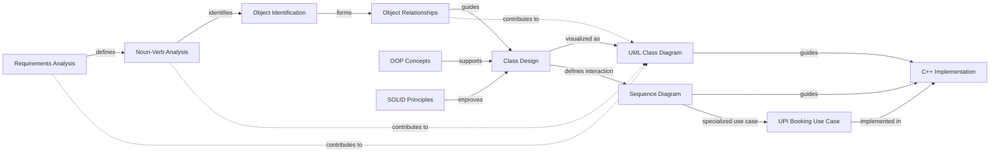

# Cinema Booking System
> A C++ console-based Cinema Booking System designed to demonstrate Low-Level Design (LLD), Object-Oriented Programming (OOP), SOLID principles, UML modeling, and software engineering practices.

---

## Video Demo

<video src="MovieTicketBookingSystem%20video/project%20demo.mp4" controls width="100%"></video>

---

## Project Overview
The Cinema Booking System is a simple console application built in C++. It simulates how a customer books a movie ticket in real life. The system takes you through the entire process: browsing movies, choosing a show and a seat, calculating the ticket price, selecting a payment method, and finally printing the confirmed ticket.

This project exists to show how real-world problems can be translated into well-structured code using standard software engineering steps:
- Requirements Analysis
- Noun-Verb Analysis
- Object Identification
- Object Relationships
- Object-Oriented Programming
- SOLID Principles
- Class Design
- UML Class Diagrams
- Sequence Diagrams
- C++ Implementation

---

## Objectives
The main goals of this project are to:
- Turn real-world needs into software objects.
- Find classes and their tasks using Noun-Verb Analysis.
- Define how objects interact with each other.
- Use Object-Oriented Programming (OOP) concepts.
- Write maintainable code using SOLID principles.
- Create a clear Low-Level Design.
- Draw UML diagrams to show the system's structure.
- Draw Sequence Diagrams to show how objects communicate.
- Write the final working code in C++.
- Show the clear link between designing software and writing the code.

---

## Software Design Workflow
This project follows a step-by-step process:
```text
Requirements Analysis
         ↓
Noun-Verb Analysis
         ↓
Object Identification
         ↓
Object Relationships
         ↓
Class Design
         ↓
UML Class Diagram
         ↓
Sequence Diagram
         ↓
C++ Implementation
```
**Supporting design principles:**
- OOP Concepts ──────────→ Class Design
- SOLID Principles ──────→ Class Design

This workflow proves that coding is simply the final result of good planning and design.

## Concept Relationship Graph
This chart shows how all the major software engineering concepts connect in this project.



### What the Graph Means
- **Requirements** define what the system needs to do.
- **Noun-Verb Analysis** looks at the requirements to find possible objects and actions.
- **Object Relationships** figure out how those objects connect to each other.
- **Class Design** turns those objects into actual software classes.
- **OOP and SOLID** provide the rules for designing those classes properly.
- **UML Class Diagram** is a drawing of the system's structure.
- **Sequence Diagram** is a drawing of how objects talk to each other when the program runs.
- **The UPI Booking Use Case** is a specific example of that sequence.
- **Implementation** is turning all of this design into working C++ code.

---

## Documentation
The project documentation is split into separate folders so that each topic can be studied easily.

| # | Topic | Documentation |
|---|---|---|
| 1 | Requirements Analysis | [Open Documentation](Requirements-Analysis/requirements-analysis.md) |
| 2 | Noun-Verb Analysis | [Open Documentation](Noun-Verb-Analysis/noun-verb-analysis.md) |
| 3 | Object Relationships | [Open Documentation](Object-Relationships/object-relationships.md) |
| 4 | OOP Concepts | [Open Documentation](OOP-Concepts/oop-concepts.md) |
| 5 | SOLID Principles | [Open Documentation](SOLID-Principles/solid-principles.md) |
| 6 | Class Design | [Open Documentation](Class-Design/class-design.md) |
| 7 | UML Class Diagram | [Open Documentation](UML-Diagram/uml-class-diagram.md) |
| 8 | Sequence Diagram | [Open Documentation](Sequence-Diagram/sequence-diagram.md) |
| 9 | Relationship Graph | [Open Mermaid Source](Relationship-Graph/relationship-graph.mmd) |

---

## 1. Requirements Analysis
Requirements Analysis is simply defining what the Cinema Booking System needs to do.

**The main tasks the system must handle are:**
- The customer can view available movies, shows, and screens.
- The customer can see which seats are available.
- The customer can select a seat.
- The system checks if the seat is free and calculates the price.
- The customer chooses how to pay (UPI, Card, or Cash).
- The system processes the payment and prints a ticket.

**Detailed Documentation:** [Requirements Analysis](Requirements-Analysis/requirements-analysis.md)

---

## 2. Noun-Verb Analysis
Noun-Verb Analysis is a technique where we read the requirements and pick out the Nouns and Verbs.

**Nouns (These usually become Objects or Classes):**
`Cinema`, `Screen`, `Seat`, `Movie`, `Show`, `Customer`, `Booking`, `Payment`, `Ticket`

**Verbs (These usually become Methods or Actions):**
`view`, `select`, `book`, `calculate`, `pay`, `print`

For example, in the sentence *"Customer books a seat"*:
- **Customer** and **seat** become Classes.
- **books** becomes a Method (action).

**Detailed Documentation:** [Noun-Verb Analysis](Noun-Verb-Analysis/noun-verb-analysis.md)

---

## 3. Object Relationships
This step decides how the different objects connect to each other.

```text
Cinema ◆── Screen
Screen ◆── Seat
Show ◇── Movie
Booking ── Customer

Payment
  ▲
  ├── UpiPayment
  ├── CardPayment
  └── CashPayment
```

**Symbols Explained:**
- `◆` = Composition (A Screen cannot exist without a Cinema).
- `◇` = Aggregation (A Movie can exist without a Show).
- `──` = Association (A Booking is just linked to a Customer).
- `▲` = Inheritance (UPI is a specific type of Payment).

**Detailed Documentation:** [Object Relationships](Object-Relationships/object-relationships.md)

---

## 4. OOP Concepts
Object-Oriented Programming (OOP) uses four main ideas:

- **Encapsulation:** Grouping data and actions together safely inside a class so outside code cannot mess it up.
- **Abstraction:** Hiding complex code. The customer just clicks "Pay" and doesn't need to see the complex math happening behind the scenes.
- **Inheritance:** Creating a general "Payment" category, and letting specific types like "Cash" or "Card" inherit from it.
- **Polymorphism:** The system can process a payment without knowing if it's UPI or Cash until the exact moment it runs.

**Detailed Documentation:** [OOP Concepts](OOP-Concepts/oop-concepts.md)

---

## 5. SOLID Principles
SOLID principles are five rules that keep code clean and easy to update.

| Principle | Meaning |
|---|---|
| S | Single Responsibility Principle (A class should only have one job). |
| O | Open/Closed Principle (You can add new features without changing old code). |
| L | Liskov Substitution Principle (A subclass can easily replace its parent class). |
| I | Interface Segregation Principle (Don't force classes to use methods they don't need). |
| D | Dependency Inversion Principle (High-level code should rely on general ideas, not specific details). |

**Example of Single Responsibility in our system:**
- `BookingService` only handles the booking steps.
- `PriceCalculator` only does math.
- `TicketPrinter` only prints the ticket.

**Detailed Documentation:** [SOLID Principles](SOLID-Principles/solid-principles.md)

---

## 6. Class Design
This is where we finalized exactly what each class does.

| Class | What it does |
|---|---|
| Cinema | Holds the screens and movies. |
| Movie | Stores details about a film. |
| Screen | A physical hall with seats. |
| Seat | A physical chair. |
| Show | A movie playing at a specific time. |
| Customer | The person buying the ticket. |
| Booking | The final receipt. |
| BookingService | Controls the whole booking process. |
| Payment | A general payment method. |

**Detailed Documentation:** [Class Design](Class-Design/class-design.md)

---

## 7. UML Class Diagram
The UML Class Diagram is a visual blueprint of the system. It shows all the classes, their variables, their actions, and how they connect.

**UML Source:** `UML-Diagram/uml-class-diagram.mmd`

**Detailed Documentation:** [UML Class Diagram](UML-Diagram/uml-class-diagram.md)

---

## 8. Sequence Diagram
While the UML diagram shows the structure, the Sequence Diagram shows **time**. It shows the exact order in which objects talk to each other when the program is running.

**Example: Customer books 1 seat and pays using UPI.**
1. Customer selects a movie and seat.
2. The System checks if the seat is free.
3. The Price Calculator determines the cost.
4. The UPI Payment is processed.
5. The Booking is saved.
6. The Ticket is printed.

**Detailed Documentation:** [Sequence Diagram](Sequence-Diagram/sequence-diagram.md)

---

## Project Diagrams
- [UML Class Diagram](images/UML-diagram.png)
- [Sequence Diagram](images/squence%20diagram.png)
- [UPI Booking Sequence](images/Cinema_Booking_UPI_Sequence_Diagram.png)

---

## Project Structure
```text
Cinema-Booking-System/
│
├── README.md
├── Requirements-Analysis/
│   └── requirements-analysis.md
├── Noun-Verb-Analysis/
│   └── noun-verb-analysis.md
├── Object-Relationships/
│   └── object-relationships.md
├── OOP-Concepts/
│   └── oop-concepts.md
├── SOLID-Principles/
│   └── solid-principles.md
├── Class-Design/
│   └── class-design.md
├── UML-Diagram/
│   ├── uml-class-diagram.md
│   └── uml-class-diagram.mmd
├── Sequence-Diagram/
│   ├── sequence-diagram.md
│   └── sequence-diagram.mmd
├── Relationship-Graph/
│   └── relationship-graph.mmd
├── images/
│   ├── UML-diagram.png
│   ├── squence diagram.png
│   └── Cinema_Booking_UPI_Sequence_Diagram.png
│
└── MovieTicketBookingSystem video/
    └── project demo.mp4
```

---

## How to Run
The project is a C++ console application.

**Compile**
```bash
g++ main1.cpp -o MovieTicketBooking
```

**Run**
Linux / macOS:
```bash
./MovieTicketBooking
```
Windows:
```bash
MovieTicketBooking.exe
```

Make sure a C++ compiler like G++ or MinGW is installed.

---

## Conclusion
The Cinema Booking System is a practical demonstration of software engineering. It shows how a real-world problem is gradually turned into a clear, understandable, and maintainable software design using standard analysis, OOP, and SOLID principles.
