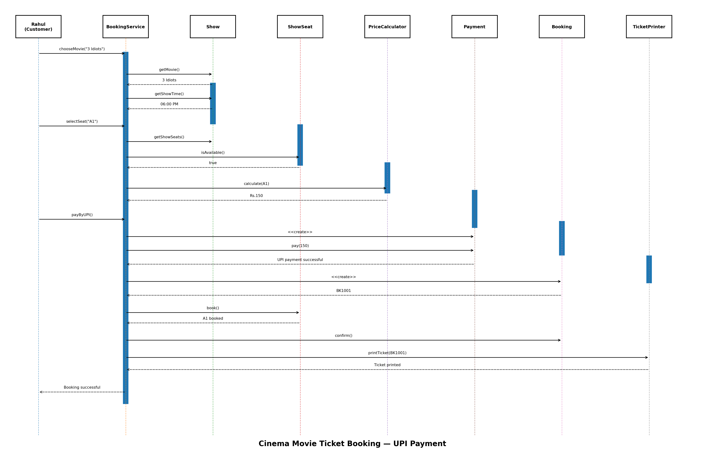
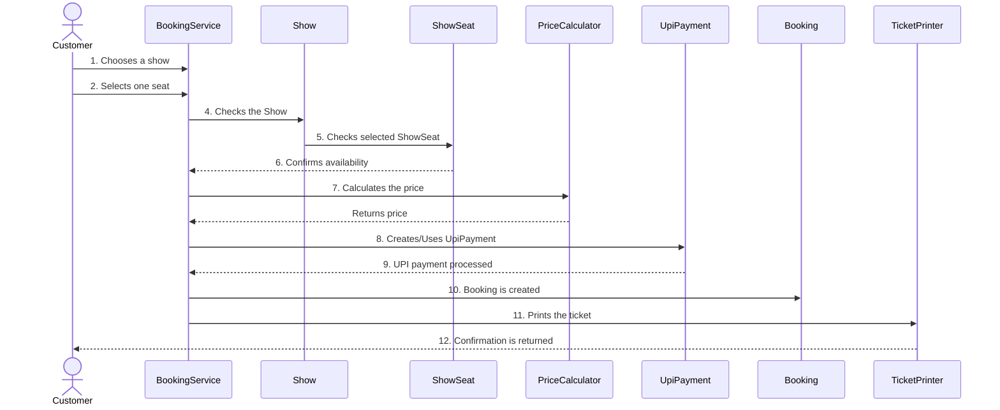

# Sequence Diagram

While the UML Class Diagram gives us a perfect map of the system's static architecture, it fails to show us **time**. We do not know the order in which functions are called during a transaction. 

To model the **DYNAMIC BEHAVIOR** of the system at runtime, we use a Sequence Diagram. 

---

## 1. How to Read a Sequence Diagram

A Sequence Diagram focuses on the exchange of messages (method calls) between objects over time.

- **Lifelines (Vertical Lines):** Each vertical dashed line represents a specific object instance existing in memory during the transaction. Time flows from top to bottom.
- **Solid Arrows (`->>`):** Represent a synchronous method call or action. The caller waits for the receiver to finish.
- **Dashed Arrows (`-->>`):** Represent a return message or response going back to the caller.
- **Activation Boxes (Rectangles on Lifelines):** (Visualized in advanced UML tools) Show the period during which an object is actively executing a process.

---

## 2. Concrete Use Case: Booking a Seat via UPI

Instead of trying to map every single scenario on one chart, sequence diagrams are best used to map specific *Use Cases*. 
Here, we map the most common workflow: **A Customer successfully books a ticket and pays via UPI.**

### Chronological Breakdown:
1. **User Input:** The `Customer` interacts with the `BookingService` UI to select a show and a specific seat.
2. **Validation:** The `BookingService` does not access the seat directly (Encapsulation). It asks the `Show` object, which in turn queries the specific `ShowSeat` object to see if it is available.
3. **Calculation:** Once availability is confirmed, the `BookingService` delegates the financial math to the `PriceCalculator`.
4. **Transaction:** The `BookingService` instantiates a `UpiPayment` object (polymorphically handled via the `Payment` interface) and calls `pay()`.
5. **Finalization:** Upon a `true` return from the payment processor, the `BookingService` finally constructs the persistent `Booking` object.
6. **Output:** The `TicketPrinter` formats the data and returns the confirmation to the `Customer`.

---

## 3. Embedded Sequence Diagram

Below is the visualized timeline of the UPI transaction.

*(You can view or edit the raw Mermaid source code in [`sequence-diagram.mmd`](sequence-diagram.mmd))*

### Conclusion
By completing the Sequence Diagram, the architectural phase of the software engineering lifecycle is finished. Engineers can now look at the UML (for structure) and the Sequence (for logic) and translate this directly into the final C++ **Implementation**.
