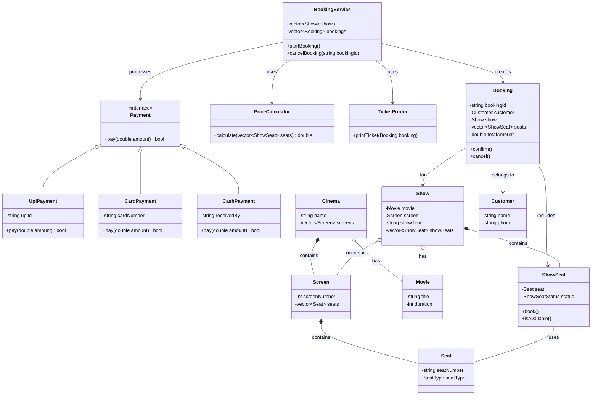

# UML Class Diagram

The Unified Modeling Language (UML) Class Diagram is the visual representation of our **STATIC STRUCTURE**. It acts as the final bridge between theoretical class design and the actual C++ codebase. 

By looking at a UML diagram, an engineer instantly understands the exact attributes a class holds, what methods it exposes, and precisely how it points to other classes in memory.

---

## 1. How to Read the UML Diagram

Our generated diagram utilizes standard UML syntax:

### Visibility Modifiers
- `-` (Minus Sign) indicates `private` visibility. The attribute/method is encapsulated and hidden from the outside.
- `+` (Plus Sign) indicates `public` visibility. The attribute/method can be called by external modules.

### Line Types (Relationships)
The lines connecting the boxes represent the relationships we mapped out earlier:
- `*--` (Solid line with filled diamond): **Composition**. E.g., `Cinema *-- Screen`. The Cinema physically owns the Screen.
- `o--` (Solid line with empty diamond): **Aggregation**. E.g., `Cinema o-- Movie`. The Cinema hosts the Movie, but doesn't exclusively own it.
- `-->` (Solid line with arrow): **Directed Association**. E.g., `BookingService --> PriceCalculator`. The service uses the calculator.
- `<|--` (Solid line with hollow triangle): **Inheritance**. E.g., `Payment <|-- UpiPayment`. UPI inherits from the Payment interface.

### Types and Signatures
- `vector~ShowSeat~`: Represents a C++ `std::vector` containing `ShowSeat` objects.
- `+calculate(vector~ShowSeat~ seats) double`: A public method named `calculate` taking a vector of seats and returning a `double`.

---

## 2. Embedded UML Diagram

Below is the complete architectural UML for the Cinema Booking System. 

*(You can view or edit the raw Mermaid source code in [`uml-class-diagram.mmd`](uml-class-diagram.mmd))*

---

### Next Steps in Design
The UML Class Diagram shows us the blueprint, but it doesn't show us *how* these classes talk to each other while the program is running. To model runtime behavior, we use a **[Sequence Diagram](../Sequence-Diagram/sequence-diagram.md)**.
