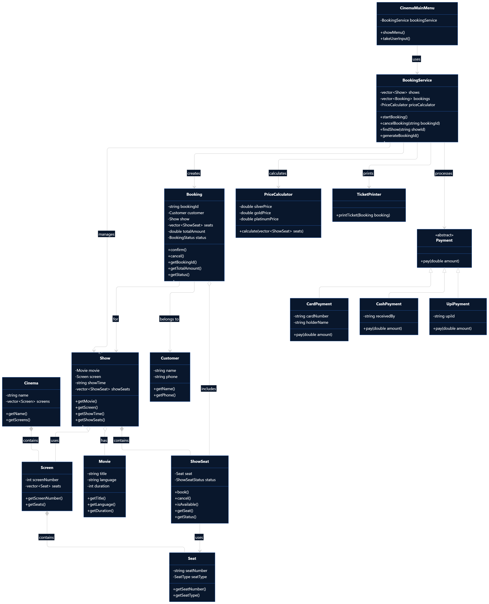

# UML Class Diagram
The UML Class Diagram represents the **STATIC STRUCTURE** of the system. It visualizes the final refined class design derived from our analysis.

Below is the embedded UML Class Diagram. You can also view the raw code in [`uml-class-diagram.mmd`](uml-class-diagram.mmd).

